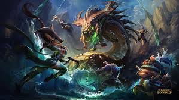

# Who Is the Carry? LoL Project

A data science project analyzing which League of Legends roles are most likely to be the main carry! :D

## Project Question
Among winning professional League of Legends teams, which role is most likely to be the main impact player?

## Project Idea
Each player is given a role-adjusted impact score. This means players are compared to other players in the same role, so supports, junglers, and damage roles can be evaluated more fairly.

## Prediction Problem
I will build a classification model to predict whether a player is the main carry.

- `1` = main carry
- `0` = not main carry

## Author :D
Owen Tran

