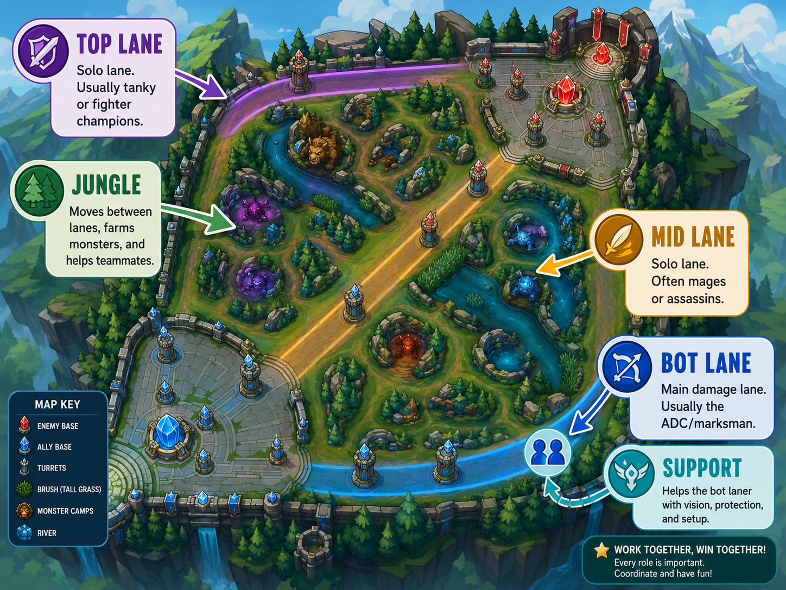
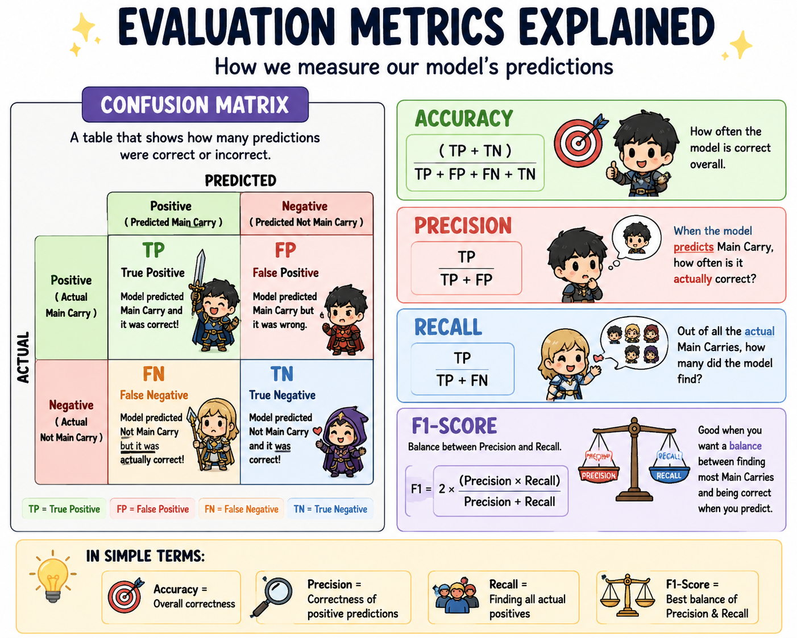
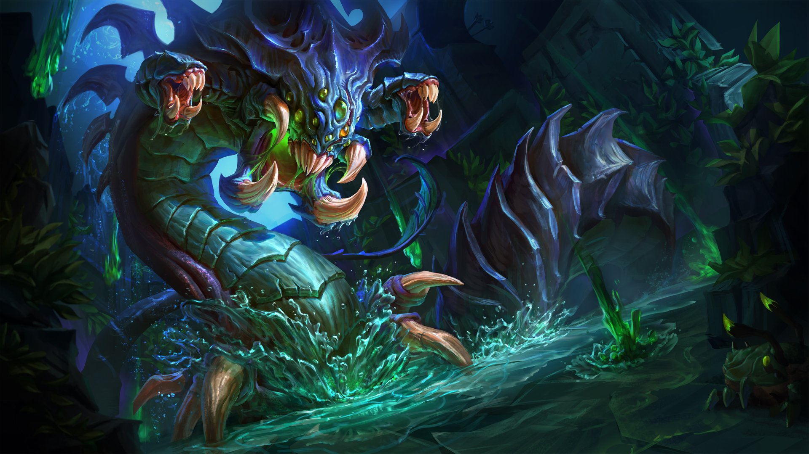

## Who Is the Carry? LoL Project

I made a data science project about professional League of Legends esports in 2025.

In League of Legends, each team has five players with different roles: top, jungle, mid, bot, and support. This project finds which role is most often the "carry" on a winning team.

  

## Project Question
Among winning professional League of Legends teams, which role is most likely to have the most impact on the game?

## Project Idea
A normal “carry” score based only on kills, damage, or gold would mostly favor damage-heavy roles like bot and mid. That would not be fair because every role has a different job.

To make the comparison more fair, I use a role-adjusted impact score.

This means each player is compared only to other players in the same role:

Top players are compared to other top players
Junglers are compared to other junglers
Mid laners are compared to other mid laners
Bot laners are compared to other bot laners
Supports are compared to other supports

This helps value different types of impact. 
For example, supports can be rewarded for assists and vision, while damage roles can be rewarded for damage and fighting impact.

## Features Used
The role-adjusted impact score uses five main factors:

Factor	                      Simple Meaning
KDA	                          Did the player get kills/assists while avoiding deaths?
Kill Participation	          Was the player involved in many of the team’s kills?
Damage Per Minute  	          Did the player deal strong damage for their role?
Vision Per Minute	            Did the player help provide map vision for their role?
Low Death Share	              Did the player avoid being a large share of the team’s deaths?
Prediction Problem

I built a classification model to predict whether a player is the "carry" on their winning team.

1 = main impact player
0 = not main impact player

## Models
I built two models:

1. Baseline Logistic Regression Model
  This model used simple stats like position, kills, deaths, assists, team kills, and team deaths.
2. Final Logistic Regression Model
  This model added better engineered features, such as KDA, kill participation, damage per minute,    vision per minute, and role-adjusted performance features.

I evaluated the models using a confusion matrix finding metrics like: 
  accuracy:
    (TP + TN) / (TP + FP + FN + TN) 
  precision:
    (TP) / (TP + FP)
  recall:
    (TP) / (TP + FN) 
  F1-score:
    balance btw precision and recall 

  

## Author
Owen Tran

  

